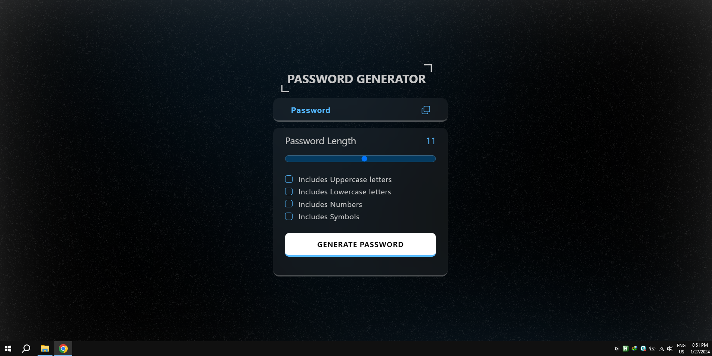

# JS-Exercise
🚀 JS Front-end Exercise Repository 🌟

## Features:

✅ Practical tasks and exercises.

🚀 Performance-focused solutions.

📝 Step-by-step guidance.

🔍 Code optimization tips.

💡 Multiple perspectives.

Happy coding! If you have any questions or need assistance, feel free to open an issue or reach out. 🤝

 

